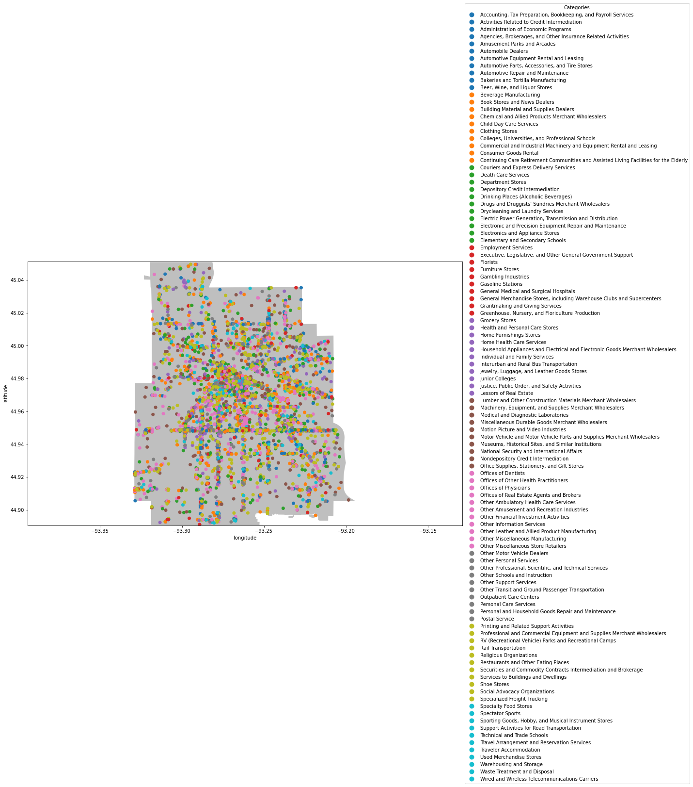
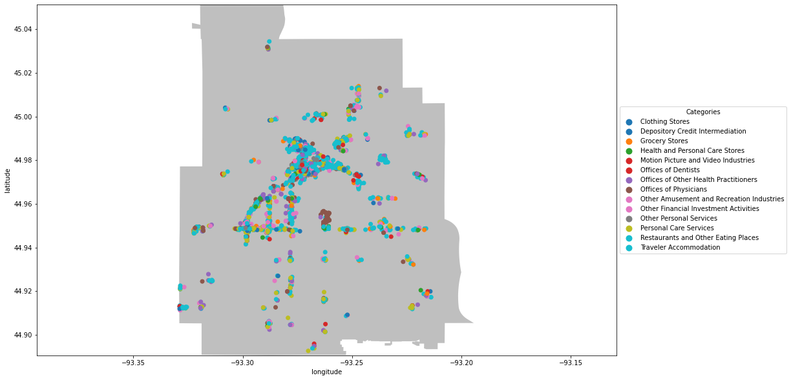
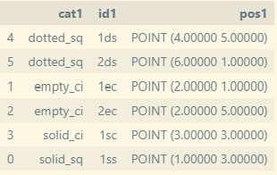
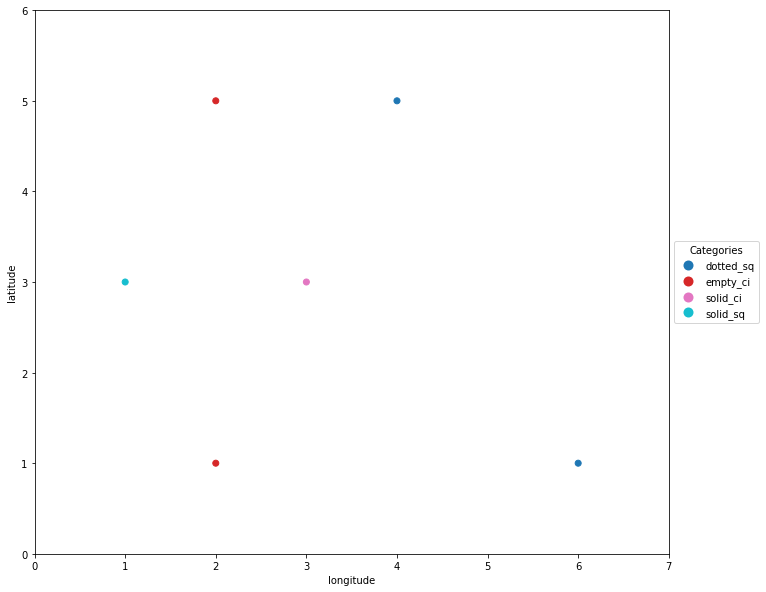
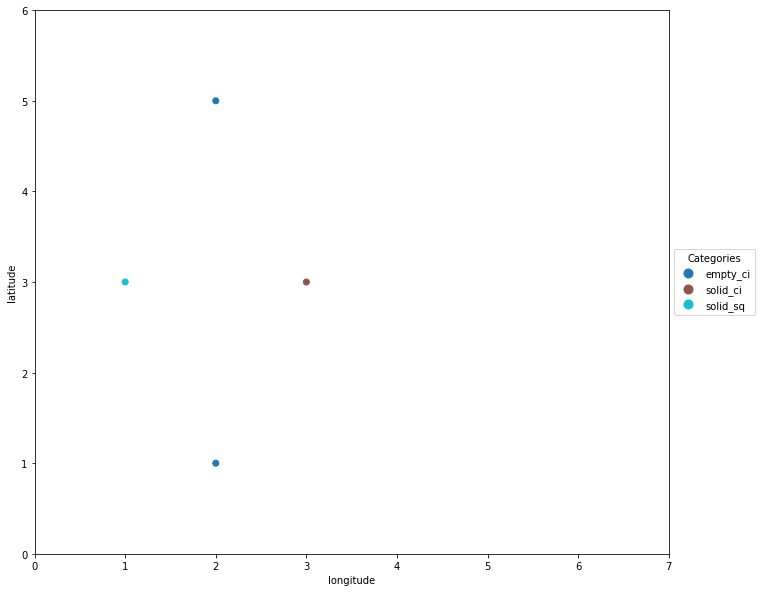

# General Co-location Miner
___
> This repository contains the code for the spatial-colocation package, which implements the main algorithm from:
>
>Shekhar, S., Huang, Y. (2001). Discovering Spatial Co-location Patterns: A Summary of Results. In: Jensen, C.S., Schneider, M., Seeger, B., Tsotras, V.J. (eds) Advances in Spatial and Temporal Databases. SSTD 2001. Lecture Notes in Computer Science, vol 2121. Springer, Berlin, Heidelberg. https://doi.org/10.1007/3-540-47724-1_13
>
> Sample code for finding emergent co-locations across a time-series of events is also included in this repository, but not in the spatial-colocation package. Emergent co-location is a topic of ongoing research and the code included here may be used as a starting point for future works.
___
# What is Co-Location?
Spatial Co-location patterns are groups of objects or events that occur near each other frequently within a dataset. The definition of "near" is a spatial relation, which is often some distance threshold such as 100 meters. This would mean that two objects within 100 meters of each other are co-located. 

## Key Terms
1. Participation Ratio: For a given co-location, the Participation Ratio of each class in the co-location is the proportion of total instances of the class that take part in the colocation.
- e.g. If there are 4 instances of class A (A1,A2,A3,A4), and 2 of them participate in the co-location {A,B} ({A1,B1},{A2,B2}), then the participation index of A in {A,B} is 0.5
2. Participation Index: This is the minimum Participation Ratio of all items in a co-location.
- e.g. For the co-location {A,B}, the Participation Ratio of A is 0.5. If the Participatio Ratio of B is 0.3, then the Participation Index of {A,B} is 0.3
3. Prevalence: The prevalence of a co-location is defined as the participation index of the group of classes that constitute it.
4. Spatial Relation: A Reflexive and Symmetric function R(A,B) which is True if a A and B are within a defined spatial threshold of each other.
5. Neighborhood: The set of all items that have a spatial relation with a specific item.
6. Conditional Probability: The probability of an event given that another event has already ocurred. In this context, it is the probability that an item is part of a co-location given that item has a specific class.
7. Event-Centric Conditional Probability: The probability that event(s) of type B (B can be a set of classes) are within the spatial relation neighborhood of an event of type A.

# What You Can Get
Co-location pattern mining can distill a large dataset with many different classes into a much smaller and interpretable set. The motivating example for this work is a set of Points of Interest (POIs) in the city of Minneapolis, Minnesota which are labeled by category. Using co-location pattern mining the plot of all points:



Can be reduced to a plot of just the prevalent size 4 co-locations:



And the 5 rules for size 4 co-locations with the highest conditional probability:
```
{Clothing Stores, Other Amusement and Recreation Industries, Personal Care Services} => Restaurants and Other Eating Places (0.4163, 1.0)
{Health and Personal Care Stores, Offices of Other Health Practitioners, Personal Care Services} => Restaurants and Other Eating Places (0.4101, 0.9996)
{Motion Picture and Video Industries, Other Financial Investment Activities, Other Personal Services} => Traveler Accommodation (0.4396, 0.9988)
{Offices of Dentists, Offices of Other Health Practitioners, Personal Care Services} => Restaurants and Other Eating Places (0.4055, 0.9983)
{Offices of Other Health Practitioners, Offices of Physicians, Personal Care Services} => Restaurants and Other Eating Places (0.4511, 0.9982)
```

Can be used to draw conclusions like:
- Restaurants __always__ appear nearby groups that have Clothing Stores, Personal Care Services, and Other Amusement and Recreation Industries
- Restaurants often appear near Dentists' Offices, Personal care Services, and other Health Care Stores/Practitioners

Many other applications for co-location exist such as:
- exploring potential locations for a new business
- [finding relationships between different types of cells in cancer patients](http://www.spatial.cs.umn.edu/Courses/Fall21/5715/homeworks/G13_News_Presentation.pdf)

# The Co-location Package

## Installation
```python
pip install general-colocation
```
## Usage

### __Data Pre-Processing__
The input to the `general` function is a pandas DataFrame with, at a minimum, columns for:
1. position: By default, items in this column must be a GeoPandas datatype (Point, Polygon, Line) so that distance calculations may be performed. It may be possible to define a custom spatial relation function that works with other data types, but none are included in the `relations.py` file of the package.
2. class: Labels to separate features by. 
3. id: Unique identifiers for each instance of a class.

### __Optional Configurations__
There are several optional parameters for the `general` function that modify the spatial relation, prevalence, and conditional probability thresholds as well as the format of the output data. See the [Key Terms](https://github.com/andrew-lafortune/ColocationMiner/blob/master/README.md#key-terms) section for more details on terms like prevalence and event-centric conditional probability.

- k: The largest size co-location to find. All co-locations of size k=1,...,k will be returned as items in the output list T.
- theta: The prevalence threshold. Co-locations with a participation index below theta will be pruned from the output.
- alpha: The conditional probability threshold. Association rules with an event-centric conditional probability below alpha will be pruned from the output.
- relation: The spatial relation function to use when determining an item's neighborhood. The relation is a minimum distance in meters by default, but can be changed to a unit distance with the string "unit", or to a custom function by passing a function name to this parameter.
- threshold: The distance threshold for the chosen relation function in the basic cases. Some other type of threshold may be used in user-defined relation functions.
- plot: If True, a scatter plot of all instances of prevalent co-locations will be shown. This only works when using a backend that will produce graphics or in an interactive environment like Jupyter Notebook.
- shape_file: A path to a directory with a shape object to plot co-locations on top of.
- out_plot: A path to a directory in which to store a scatter plot of co-locations for each value k=1,...,k
- out_csv: A path to a directory in which to store a .csv file with one row for each co-location instance of size k

### __General Co-location__
```python
T,R = colocation.general(data, position_column, class_column, id_column, k=3, theta=0.6, alpha=0.5, 
                        relation='meter', threshold=100, plot=False, shape_file=None, out_plot=None, out_csv=None):
```

Configurable to: 
- show a plot of all k-colocations with a participation index of theta or higher
- store the plot of each set of co-locations for k=1,...,k as a .png file
- store the items in the set of prevalent k-colocations as a .csv file

Returns:
- a list of DataFrames T, one for each k=1,...,k
- the set of association rules R with conditional probability of alpha or higher

# Emergent Co-location (not packaged)
Emergent co-location can be used to find 
## Emergent Co-location
```python
T,R = emergent(data, new_events, position_column, class_column, id_column, time_column, time_freq=None, old_events=None, theta=0.6, alpha=0.5,
               relation='meter', threshold=100, plot=False, shape_file=None, out_plot=None, out_csv=None, gif=False)
```

Configurable to:
- find prevalent colocations of new events with existing events across a series of time steps 
- show the final plot of all time steps together in a single plot
- store the plot of prevalent colocations each time step as a .csv file
- write the plots of all separate time steps together as a .gif file in time order

Returns:
- a dictionary of DataFrames T, the colocations with participation index greater than theta for each time step indexed by time
- the set of association rules R with conditional probability of alpha or higher for the final set of prevalent colocations in T

Assumes new_locations has a date column.

# Toy Example
To verify that the code is working correctly, execute the following code snippet:

```python
    data = pd.read_csv('data/toy_data.txt')
    data['pos'] = gpd.points_from_xy(data.x,data.y)

    T,R = general.colocate(data, 'pos','class','id',relation='unit',threshold=2.3)

    
    print('\n',T[-1],'\n')
    
    for r in R:
        print(r)
```

By running the command:
```
    colocation
```

The terminal output should look something like this (timing may vary slightly):
```
    |C1| = 4, |P1| = 4, |R1| = 0, Rows in T1 = 6, Elapsed Time: 0:00:00.002245
    |C2| = 6, |P2| = 3, |R2| = 6, Rows in T2 = 7, Elapsed Time: 0:00:00.028943
    |C3| = 1, |P3| = 1, |R3| = 3, Rows in T3 = 2, Elapsed Time: 0:00:00.046490

            cat1  id1      cat2  id2      cat3  id3                     pos3
    1  empty_ci    1  solid_ci    1  solid_sq    1  POINT (1.00000 3.00000)
    5  empty_ci    2  solid_ci    1  solid_sq    1  POINT (1.00000 3.00000) 

    {solid_sq} => empty_ci (1.0, 1.0)
    {empty_ci} => solid_sq (1.0, 1.0)
    {empty_ci} => solid_ci (1.0, 1.0)
    {solid_sq} => solid_ci (1.0, 1.0)
    {empty_ci, solid_sq} => solid_ci (1.0, 1.0)
    {solid_ci} => empty_ci (1.0, 1.0)
    {empty_ci, solid_ci} => solid_sq (1.0, 1.0)
    {solid_ci, solid_sq} => empty_ci (1.0, 1.0)
    {solid_ci} => solid_sq (1.0, 1.0)
```

What we have done here is take the data:



Which can be plotted as:



And pruned non-prevalent co-locations up to size 3 to get the result:



The 'dotted_sq' points are pruned because the lower right point with id 2ds is too far away from the other points to have a spatial relation, which makes the relation of the other 'dotted_sq' point with different classes less prevalent to the point where the relationships are below the prevalence threshold and all 'dotted_sq' points are pruned.

# Detailed Examples
Three Jupyter Notebook examples have been provided to help familiarize you with the functionality provided by this repository.

## General
### __toy_mpls_ex.ipynb__
The first example works with a modified subset of the full Minneapolis location data. It shows the process for general colocation on an output plot with a ShapeFile background which is the shape of the city of Minneapolis, Minnesota. Of the 9 total rows in the data, 5 are included in prevalent co-locations of size 3.

### __full_mpls_ex.ipynb__ (and full_mpls_exk4.ipynb, same code for larger co-location size)
This example works with the full set of Minneapolis location data provided by [SafeGraph](http://safegraph.com/) for educational/research purposes. It is interesting that the output plot for size 3 co-locations reveals patterns of popular commercial areas such as downtown Minneapolis, Lyndale Avenue, and Lake Street. The co-locations are grouped by their NAICS top-category designations, so the association rules printed in cell 6 reveal which types of stores are commonly co-located together such as Clothing Stores, Personal Care Services, and Restaurants, with a 99.79% conditional probability that a pair of Clothing Store and Personal Care Services will have a Restaurant within 100 meters of it. This notebook can be modified to also look at groupings by brand or NAICS sub-category and see what other patterns emerge.

## Emergent
### __mpls_visit.ipynb__
This example works with another set of [SafeGraph](http://safegraph.com/) data which includes the opening dates for some of the locations in the opened_on column. Using this column we can split the data into old locations, which don't have an opened_on date and are assumed to have been open before that data was available, and new locations which do have an opened_on date. A simplified version of the general colocation algorithm is run for each time step only considering relations between new locations and locations that existed prior to the current timestep. Making this comparison repeatedly and adding new events to the list of old events after their time step shows some of the emerging patterns like when a new chain of restaurants is started and frequently co-locates with a competitor.

The notebook also takes a closer look at the locations of Roti Mediterranean Grill. The mined association rules show that it always co-locates with Bruegger's, Caribou Coffee, and Starbucks Coffee, and the last figure shows the locations in downtown Minneapolis and on the East Bank campus of the University of Minnesota. It is worth noting that the campus location has since closed, and another location is open in St. Louis Park. These discrepancies represent the limited scope of the data in space (only the Minneapolis area) and time (the campus location only closed recently). As more data becomes available and further research is done on Emergent Co-Location mining techniques, more significant conclusions should be possible.

# Dataset Citation
The data used in the Jupyter Notebook examples comes from [SafeGraph](http://safegraph.com/), a data company that aggregates anonymized location data from numerous applications in order to provide insights about physical places, via the [SafeGraph](http://safegraph.com/) Community. To enhance privacy, SafeGraph excludes census block group information if fewer than two devices visited an establishment in a month from a given census block group.